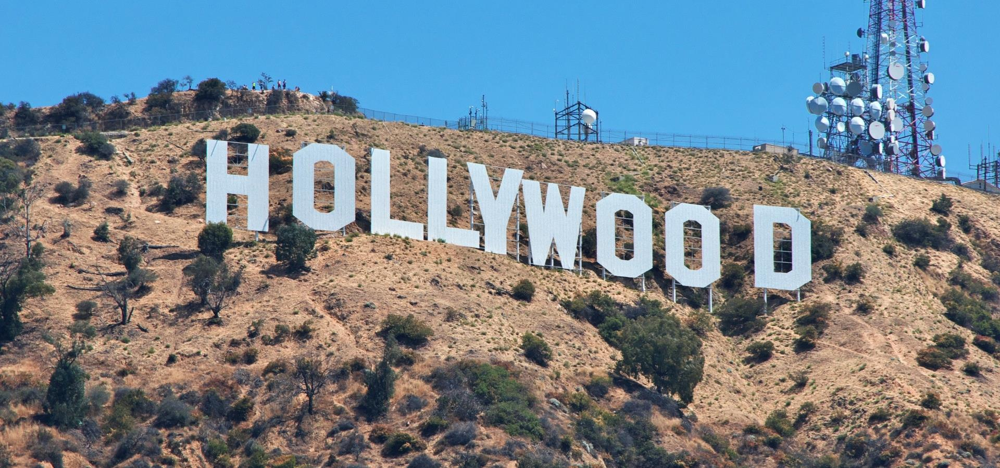
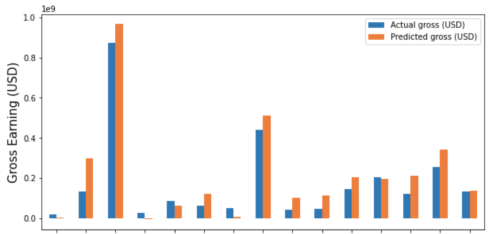

# Producing the hollywood movies: a financial investigation

Movies make up a large portion of the entertainment business and producing a movie end-to-end requires millions of dollars. In this project, I present a machine learning model predicting the revenue of movies. This model is useful for private investors, sponsors, film studios and entertainment companies that are financing the movies. I performed my analysis mainly on Hollywood, because it is the largest film industry in the world with almost $37 billion dollars gross domestic product in 2021.

## Data

- Movies released in the United States between 2015 and 2022 (scraped from imdb.com)
- Oscars Major Award Nominees & Winners 1928-2021
- Top 1000 movies on imdb.com

## Developer instructions

### Files included
   
- **1_IMDBscraper_Step1.ipynb.** This notebook scrapes the primary information on all movies from imdb.com.
- **2_IMDBscraper_Step2.ipynb.** As the second step of scraping, this notebook retrieves the award information for each movie that was scraped in the first step.
- **3_IMDBscraper_Step3.ipynb.** Finally, this notebook scrapes the imdb page of each movie one by one.
- **4_Academy_awards_df_(adding_2021).ipynb.** I simply added the 2021 Oscar award data to the Oscars dataset that I downloaded from kaggle.com. This data is used for feature engineering purposes.
- **5_DataPrep_and_EDA.ipynb.** Movies that are released in the US between the years 2015-2021 are treated and prepared in this notebook.
- **6_DataPrep_ValidationDataset.ipynb.** Same preparation steps are applied to the validation data, which are the movies from the year 2022 that are released in the U.S.
- **7_Regression_Model.ipynb.** I built a linear regression model to predict the movie revenues.
- **Presentation.pdf.** I present my key findings in this presentation. 

## Key findings

- Movie revenue strongly correlates with the production budget.
- Genre is the primary determinant in the average budget necessary for producing the movie.
- A director with a notably successful career can make a significant impact on the success of the movie. 
- Choosing the leading actors/actresses based on whether they have an Oscar or not barely makes a difference in the ultimate revenue.
- Actual vs. predicted revenue for 15 random movies:

## Tools

- Jupyter notebook 6.4.8.
- Web Scraping (bs4)
- Numpy, pandas, scikit-learn
- Seaborn, matplotlib
- Tableau

### References

[Tablaeu file: Movie_industry](https://public.tableau.com/views/Movie_industry/Budget_vs_Gross_per_genre?:language=en-US&:display_count=n&:origin=viz_share_link)

[Oscars Major Award Nominees & Winners 1928-2020](https://www.kaggle.com/datasets/darinhawley/oscars-major-award-nominees-winners-19282020)

[Imdb’s Top 1000 Movies ](https://github.com/mrzeynalli/Python/tree/main/UoE%20-%20Projects/TOP1000%20Movies%20by%20IMDb)

